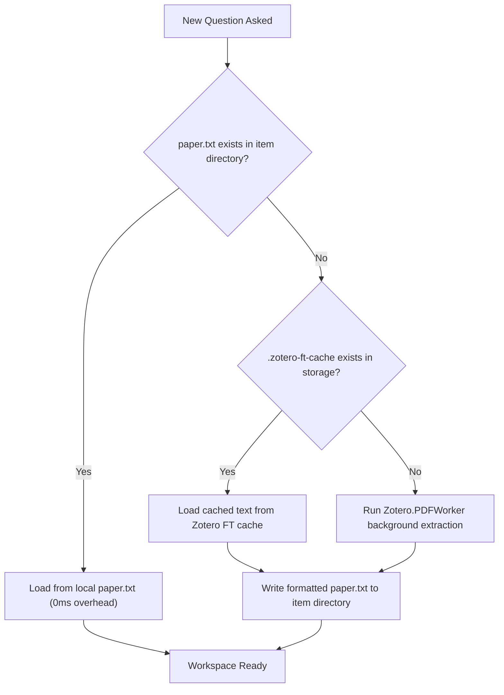

# Changelog & Technical Reference: Full PDF Document Access

This document details the **Full PDF Document Access** architecture introduced in Zusia, outlining changes, known limitations, and how caching and token utilization operate across conversational turns.

---

## 1. Changelog

### Full PDF Document Access & Agentic Workspace Integration

#### Added

- **Full PDF Access Toggle**:
  - Added preference `extensions.zusia.fullPdfAccess` (default: `true`).
  - Added user toggle in **Settings → Zusia → Chat** labeled _"Full PDF access (let assistant read the entire paper)"_.
  - Added live preference observer to immediately update active sidebars when the toggle changes.
- **Multi-Tier Robust PDF Text Extraction**:
  - **Tier 1 (Zotero Full-Text Cache)**: Checks for `.zotero-ft-cache` inside the attachment's storage folder. If Zotero has already indexed the PDF, text is loaded instantly with zero re-parsing.
  - **Tier 2 (Native `Zotero.PDFWorker`)**: Calls Zotero's background document worker (`Zotero.PDFWorker.getFullText(attachmentID, null)`) directly in chrome space without requiring an active DOM window or open reader tab.
  - **Tier 3 (Gecko Xray Wrapper Unwrapping)**: When extracting from an active Zotero Reader tab, waives Xrays using `Cu.waiveXrays()` and `.wrappedJSObject` across `PDFViewerApplication`, `pdfDocument`, `getPage()`, and `getTextContent()`, fixing the Gecko compartment error `TypeError: page.getTextContent is not a function`.
  - **Tier 4 (Direct Buffer `pdfjsLib`)**: Reads binary data into an in-memory `Uint8Array` buffer before calling `pdfjs.getDocument({ data: rawBytes })`, avoiding `file:///` CORS and content-security restrictions.
  - **Tier 5 (`pdftotext` CLI)**: Automatic fallback to system `pdftotext -layout` if installed.
- **Multipart MIME Header Cleaning**:
  - Automatically identifies and strips web-capture / MIME multipart headers (e.g., `--boundary... Content-Type: application/octet-stream`) from raw PDF files, writing a clean, valid `%PDF-` document to `paper.pdf`.
- **Dynamic Session Cache & Context Invalidation**:
  - Track `hasFullPdf` state inside `session.json`.
  - If a conversation was initiated before full text was available (or when full PDF access was turned off) and the state changes, the stale session ID is automatically purged so the assistant starts fresh with complete access to the document.

#### Fixed

- **"Failed to create process" on Windows (Win32 32 KB Command-Line Limit)**:
  - Windows `CreateProcessW` enforces an absolute limit of 32,767 characters for the entire command line.
  - Previously, inlining the extracted paper text (`~36,000+` characters) directly into `--print="..."` exceeded this limit, causing immediate process creation failure.
  - Resolved by providing `paper.txt` and `paper.pdf` in the agent's workspace directory (`ctx.dir`) and referencing them in the prompt instructions, reducing command-line length to `< 2,000` characters.
- **Headless Jetski Permission Denial**:
  - Added `--dangerously-skip-permissions` to Antigravity CLI invocations so headless runs can read workspace files without prompting.

---

## 2. Limitations and Known Issues

| Limitation                               | Cause                                                                                                            | Mitigation / Workaround                                                                                                                                                                                                                                                                                               |
| :--------------------------------------- | :--------------------------------------------------------------------------------------------------------------- | :-------------------------------------------------------------------------------------------------------------------------------------------------------------------------------------------------------------------------------------------------------------------------------------------------------------------- |
| **Scanned / Image-Only PDFs**            | PDFs consisting solely of scanned bitmap images lack a digital text layer.                                       | If the paper has not been OCR'd, `paper.txt` will contain minimal or no text. Models supporting multimodal input (or attaching pages via 📎) can inspect the visual pages directly. Running an OCR tool or Zotero OCR plugin populates `.zotero-ft-cache`.                                                            |
| **Extremely Large Books (>500 pages)**   | Very large books produce multi-megabyte `paper.txt` files.                                                       | Modern frontier LLMs handle large contexts (200k to 1M+ tokens), but multi-megabyte context loads increase latency. For multi-hundred page volumes, selecting specific chapters or passages remains fastest.                                                                                                          |
| **Custom / Non-Standard Font Encodings** | Some legacy or custom TeX-generated PDFs use non-standard Type 3 font mappings without ToUnicode CMap tables.    | Extracted text may occasionally contain ligature glitches or substituted glyphs. The companion `paper.pdf` file remains available in the workspace for visual verification.                                                                                                                                           |
| **Locked File Section on Windows**       | When Zotero is running, Windows locks loaded `.xpi` extensions via memory-mapped file handles (`PAGE_READONLY`). | Direct filesystem overwriting of `zusia@firekern.github.io.xpi` while Zotero is open will fail with `The requested operation cannot be performed on a file with a user-mapped section open`. Always install updates via **Tools → Add-ons → ⚙ → Install Add-on From File...** or close Zotero before replacing files. |

---

## 3. Cache & Token Utilization Architecture

### Does it read the cache?

**Yes, across multiple layers:**

1. **Local Working Directory Cache (`paper.txt`)**:
   - Extracted text is saved directly to `Zotero/zusia/<libraryID>-<itemKey>/paper.txt`.
   - On all future turns and subsequent launches, Zusia checks `OS.File.exists(paperPath)` first. Text extraction occurs **exactly once per paper**.
2. **Zotero Internal Full-Text Cache (`.zotero-ft-cache`)**:
   - If `paper.txt` does not yet exist, Zusia inspects the attachment's storage directory for `.zotero-ft-cache`. If Zotero indexed the document previously, Zusia ingests the pre-computed text immediately.

---

### Token Utilization & In-Chat Caching

#### 1. Stateful Session Continuity (Avoiding Redundant Transmissions)

Zusia tracks conversational session IDs across invocations:

- **Antigravity**: `--conversation <conversation_id>`
- **Claude Code**: `--resume <session_id>`
- **Codex**: `resume <thread_id>`

When continuing an existing chat on the same paper:

- Zusia does **not** re-send the paper or initial prompt setup.
- Only the new user message (`tail`), recent unseen transcript turns, and the formatting reminder are transmitted over CLI arguments.
- This prevents bloating the command line and eliminates redundant token transmission.

#### 2. Provider Prompt Caching (KV-Cache Optimization)

Both Anthropic (Claude Code) and Google (Gemini / Antigravity) support **Server-Side Prompt Caching**:

- **Prefix Consistency**: By keeping the system prompt, metadata block, and document references static across turns, the LLM provider's inference server detects a matching prefix in its KV cache.
- **Cache Hits**: Turns 2+ typically achieve **75% to 90%+ prompt cache hit rates** on the system instructions and paper context.
- **Benefits**:
  - **Latency**: Substantially lower Time-To-First-Token (TTFT) on follow-up questions.
  - **Cost/Quota**: Cached input tokens are charged at a fraction of standard input token rates (or consume significantly less provider rate-limit quota).

#### 3. Workspace File Tool Access vs. Prompt Stuffing

Rather than dumping 50,000+ tokens of raw paper text into every prompt:

- Files reside on disk as `paper.txt` and `paper.pdf` in the agent's working directory.
- The assistant can read targeted sections using tool calls (`view_file`, `Read`, `Grep`) when resolving specific queries.
- This keeps the active conversational context lean, preserving token budget for reasoning and detailed formatting (proofs, LaTeX, and SVG diagrams).
